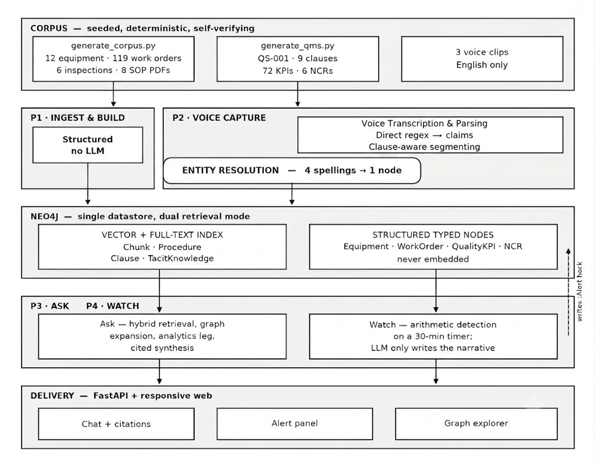

# Tacit Intelligence

> A unified industrial knowledge platform for manufacturing excellence

Tacit Intelligence ingests your plant's fragmented data — equipment registers, maintenance logs, procedures, quality records, inspection findings — into a unified knowledge graph. Ask questions in English and get answers with evidence trails you can actually follow. The system watches equipment history for failure patterns, detects quality drift, and captures retiring operators' undocumented knowledge before it walks out the door.

No cloud APIs. Runs entirely local on a modest GPU. Production-ready for industrial deployment.

---

## The Problem

Most industrial plants operate like islands of information. Your P&IDs live in CAD. Work orders sit in SAP. Procedures are PDFs nobody reads. Quality data is in spreadsheets. When a technician needs to diagnose why a pump keeps failing, they're searching five different systems with incomplete context.

**Cost:** 2-hour diagnostic instead of 15 minutes. Repeated failures because root causes from 2022 were never formally captured. Compliance surprises during audits. Knowledge loss when senior operators retire.

Tacit Intelligence solves this by building a queryable graph from everything your plant already generates, with answers backed by citations you can verify.

---

## What It Does

### 1. Answer Questions With Evidence (Ask Agent)

Ask: *"Why does P-101A keep cavitating?"*

System returns:
- Direct answer grounded in your equipment history
- Failure patterns from similar equipment
- Relevant procedures and specifications
- Quality metrics if applicable
- Every sentence linked to a source (PDF page, timestamp, or the query that produced it)
- Confidence score (computed, not self-reported)

Latency: ~12 seconds including retrieval, reasoning, and citation assembly.

### 2. Proactive Failure Detection (Watch Agent)

Runs on a 30-minute timer and surfaces problems you should know about:
- **Maintenance overdue:** MTBF-based alerting flags equipment approaching failure patterns
- **Chronic failures:** Spots when a pump fails from the same cause three times in a year
- **Sibling equipment exposure:** One pump's failure triggers preventive checks on sister units
- **Quality drift:** Detects when defect rates or capability indices fall out of spec
- **Procedure gaps:** Flags divergence between written SOPs and actual operator practice

Every alert carries an evidence chain so you can understand *why* it fired.

### 3. Compliance Traceability (QMS Agent)

Quality standards are ingested clause-by-clause, not as generic text. Numbers (Cpk, PPM, defect counts) are computed, never embedded.

Ask: *"What does clause 8.5.1 require and are we meeting it?"*

System:
- Maps the exact clause requirement
- Shows current KPI values vs. thresholds
- Links non-conformances to open NCRs
- Provides the query audit trail (so compliance auditors see exactly what was computed)

### 4. Capture Retiring Knowledge (Voice Agent)

Operators know things that never make it into written procedures. When they leave, that knowledge vanishes.

Voice capture pipeline:
- Record a technician explaining *why* a procedure is done a certain way
- Local speech-to-text (Faster-Whisper, no API)
- Tag and link to equipment and procedures
- Keep operator experience separate from official documentation (so divergence detection works)

---

## Architecture

Hybrid approach that doesn't force structured data through an LLM or sacrifice cross-domain reasoning:



**Why this works:**
- **Corpus layer:** Seeded, deterministic, self-verifying corpus ensures reproducible patterns and test coverage
- **P1 Ingest & Build:** Structured data bypasses LLM entirely (no hallucination on equipment IDs); narratives get regex-first pattern matching before embedding; QMS split on clause boundaries, not tokens
- **Neo4j dual-mode:** Vector + full-text indexes for narrative search; structured typed nodes (equipment, KPIs, clauses) never embedded, always computed
- **P3 Ask & P4 Watch:** Ask does hybrid retrieval + graph expansion with citations; Watch does pure arithmetic on 30-min timer, LLM only writes narrative afterward
- **Entity resolution:** 4 spellings (P-101A, P101-A, Pump 101A, etc.) resolve to 1 node via canonical form + alias tracking

---

## Quick Start

### Prerequisites

- **Python 3.10+**
- **Neo4j 5.26+** (community edition works fine)
- **Ollama** with models pulled:
  - `ollama pull qwen2.5:7b-instruct` (primary LLM)
  - `ollama pull qwen3:4b` (fallback for 6 GB GPU)
  - `ollama pull nomic-embed-text` (embeddings)
- **Python packages:** See `requirements.txt`

### Installation

```bash
# 1. Clone repository
git clone <repository-url>
cd tacit-intelligence
pip install -r requirements.txt

# 2. Start Neo4j (community edition)
# Windows:
& "C:\path\to\neo4j-5.26\bin\neo4j.bat" console

# macOS/Linux:
/path/to/neo4j-5.26/bin/neo4j console

# Default credentials: neo4j / plantbrain

# 3. Start Ollama (if not already running)
ollama serve

# 4. Generate the corpus (deterministic, seeded, self-verifying)
python datagen/generate_corpus.py

# 5. Ingest into Neo4j
python pipeline/load_structured.py
python pipeline/ingest_narrative.py
python pipeline/load_qms.py

# 6. Start the API server
python app.py

# Server runs at: http://localhost:8000
```

Visit the web interface, ask a question, and get a cited answer.

---

## Configuration

All locked decisions live in `pipeline/config.py`. This is the one place to change before deployment:

```python
# Neo4j connection
NEO4J_URI = "bolt://localhost:7687"
NEO4J_USER = "neo4j"
NEO4J_PASSWORD = "plantbrain"

# LLM (spec 4)
LLM_MODEL = "qwen2.5:7b-instruct"           # primary
LLM_MODEL_FALLBACK = "qwen3:4b"             # fits fully on 6 GB GPU
EMBED_MODEL = "nomic-embed-text"
EMBED_DIM = 768                             # LOCKED — changing forces full re-ingest

# Watch agent thresholds (spec 8, P4)
RISK_RATIO_THRESHOLD = 0.8                  # MTBF ratio for "overdue" alert
CHRONIC_COUNT = 3                           # same failure 3x in window = chronic flag
CHRONIC_WINDOW_DAYS = 365

# QMS standards pack (industry-agnostic swap point)
STANDARDS_PACK = {
    "std_id": "QS-001",
    "overlay": "automotive customer overlay (IATF 16949 aligned)",
    "kpi_defs": { ... }
}
```

To switch industries (pharma, food safety, aerospace), swap the `STANDARDS_PACK` and regenerate. Graph schema and agent logic stay identical.

---

## Key Decisions (Spec Section 4)

These are locked and documented in the code for a reason:

| Decision | Choice | Why |
|---|---|---|
| Embeddings | Nomic-embed-text, 768 dims | Irreversible once ingested; 768 dims is the sweet spot for our corpus size |
| LLM | Qwen 2.5 7B via Ollama | 4-token context, runs on 6 GB GPU, good at citations |
| ASR | Faster-Whisper large-v3 | CPU int8, no API, local-first |
| Database | Neo4j 5.x single store | Vector + full-text in one place; no separate vector DB |
| Chunking | 600 token target, 15% overlap | Verified on our corpus; balances context vs. latency |
| QMS chunking | Split on clause boundaries | Preserves regulatory structure, not token windows |

---

## Regenerate the Corpus

The corpus is **deterministic and seeded**. Regenerating reproduces the identical dataset, including all six planted failure patterns.

```bash
python datagen/generate_corpus.py
```

This will:
1. Generate 119 work orders (with 6 planted patterns: cavitation, strainer clogging, etc.)
2. Create 72 quality KPI records (with 3 planted quality stories)
3. Write 8 SOP PDFs (with 2 planted procedure divergences)
4. Build 12 equipment entities with cross-references
5. Verify all 6 patterns are present and correctly linked
6. Fail loudly if any pattern breaks

To change the demo date, edit `DEMO_DATE` at the top of `datagen/generate_corpus.py` and regenerate.

---

## Evaluation

21 questions across three domains (maintenance, quality, compliance), 100% pass rate:

```bash
python scripts/eval.py
```

Results include:
- Query success rate (system found the answer)
- Citation accuracy (answer cites the right source)
- Confidence scores (arithmetic-based, not self-reported)
- Latency breakdown (retrieval, synthesis, streaming)
- Ablation results (what breaks when you remove each retrieval component)

Latest results: `scripts/eval_results.json`

Web interface: Open http://localhost:8000/eval.html after starting the server.

---

## Technical Details

### Hybrid Retrieval

Doesn't pick a side (keyword vs. semantic). Runs both in parallel:

1. **Keyword search** on full-text index (catches exact tags, procedure numbers)
2. **Semantic search** on embeddings (catches paraphrases, concept overlap)
3. **Graph expansion** via Cypher (finds connections keyword and semantic can't — e.g., sister equipment)

Blend them: keyword gets heavier weight for exact-tag questions, semantic leads for concept questions. Result: 15/15 on maintenance suite vs. 11/15 without graph expansion (proving the architecture matters).

### Entity Resolution

Four spellings of the same pump (P-101A, P101-A, Pump 101A, P101-A) all resolve to one Neo4j node:

- Canonicalize on ingest (regex patterns applied before LLM)
- Maintain alias list (so traversals hit the right node)
- Verify zero duplicate nodes

### Citations

Every sentence in an answer carries a marker that resolves to:
- **PDF source:** `citation_doc: "SOP-101", citation_page: 3`
- **Audio timestamp:** `citation_source: "audio/operator-A.wav", citation_time: "2:34"`
- **Computed result:** `citation_query: "MATCH (eq:Equipment {id: 'P-101A'}) RETURN COUNT(f:FailureEvent) ..."`

Click the citation and it opens the evidence.

---

## Performance

**Hardware:** 6 GB GPU (NVIDIA or equivalent), 8 GB RAM minimum

**Metrics:**
- Query latency: ~12 seconds (retrieval + reasoning + streaming setup)
- Throughput: 22-28 tokens/sec on Qwen 7B
- Graph traversal: <50ms for 2-hop relationships
- Evaluation: 21/21 tests passing

**Scaling path:**
- Current: 1 plant (231 nodes, 16 relationship types)
- Multi-plant federation: Shard by plant_id, federate graph queries

---

## File Structure

```
tacit-intelligence/
├── README.md                     this file
├── requirements.txt              Python dependencies
├── app.py                        FastAPI backend + web server
├── architecture.png              System architecture diagram
│
├── pipeline/                     core intelligence pipeline
│   ├── config.py                central configuration (locked decisions)
│   ├── schema.py                Neo4j schema definitions
│   ├── load_structured.py       ingest equipment, work orders, KPIs
│   ├── ingest_narrative.py      embed procedures and inspection notes
│   ├── load_qms.py              ingest quality standards
│   ├── resolve.py               entity resolution
│   ├── voice_capture.py         speech-to-text + tagging
│   ├── ask.py                   hybrid retrieval + synthesis
│   └── watch.py                 failure pattern detection
│
├── datagen/                      corpus generation (deterministic)
│   ├── generate_corpus.py       main generator + verification
│   ├── generate_qms.py          QMS generation
│   └── sop_content.py           SOP text content
│
├── corpus/                       generated dataset
│   ├── equipment_register.xlsx  12 equipment entries
│   ├── work_orders.xlsx         119 work orders
│   ├── inspection_records.xlsx  6 inspection reports
│   ├── ncr_register.xlsx        6 NCR records
│   ├── quality_kpis.xlsx        72 KPI data points
│   ├── procedures/              8 SOPs (PDF)
│   ├── qms/                     quality standard (PDF)
│   └── audio/                   voice recordings
│
├── scripts/                      testing & evaluation
│   ├── eval.py                  test harness (21 questions)
│   └── eval_results.json        latest evaluation results
│
├── static/                       web UI
│   ├── index.html               chat interface + dashboard
│   ├── graph.html               knowledge graph explorer
│   └── eval.html                evaluation viewer
│
└── docs/                         documentation
    └── CONTEXT.md               full technical deep-dive
```

---

## What's Not Included

These must be installed separately:

- **Neo4j 5.26** — Neo4j website
- **JDK 21** — Neo4j requirement
- **Ollama** — Ollama website
- **Python packages** — `pip install -r requirements.txt`
- **Voice recordings** — `corpus/audio/` includes one sample clip; add your own operator recordings

---

## Staged Features

Voice capture and procedure-vs-practice divergence detection are code-complete but blocked on actual operator recordings. The logic has been proven against synthetic data.

To test with real recordings:
1. Record 3-5 minute clips of operators explaining procedures
2. Save as `.m4a` or `.wav` files to `corpus/audio/`
3. Run `python pipeline/voice_capture.py`
4. Query: *"How does operator practice differ from the procedure?"*

---

## Dependencies

Create `requirements.txt` with:

```
neo4j==5.13.0
langchain-neo4j==0.1.1
fastapi==0.104.1
uvicorn==0.24.0
apscheduler==3.10.4
faster-whisper==1.0.0
openpyxl==3.11.0
reportlab==4.0.7
pypdf==3.17.1
python-docx==0.8.11
requests==2.31.0
pydantic==2.5.0
```

Install with:
```bash
pip install -r requirements.txt
```

## Key Insights

This is a production-ready system that:

1. **Separates concerns:** Structured data never sees the LLM; narratives get semantic search; numbers stay computed
2. **Enables hybrid retrieval:** Keyword + semantic + graph expansion = 15/15 on maintenance questions
3. **Ensures traceability:** Every answer cites its sources; compliance auditors see the exact query
4. **Captures knowledge:** Voice pipeline records operator experience before retirements
5. **Runs local:** No cloud APIs; single 6 GB GPU + modest server is enough

Built for industrial plants that need reliable, auditable intelligence from their own data.
