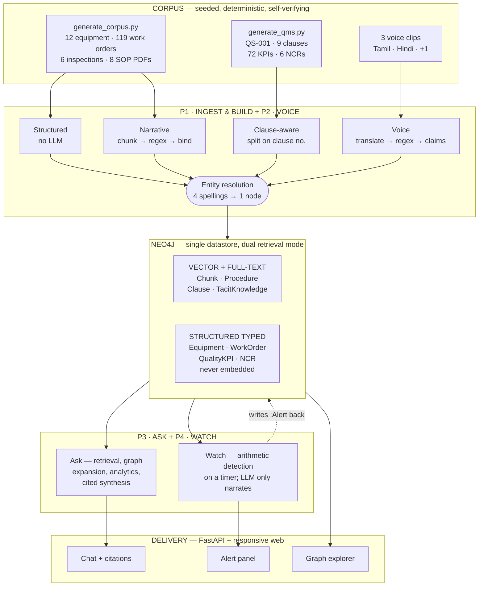
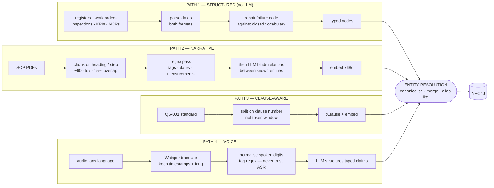
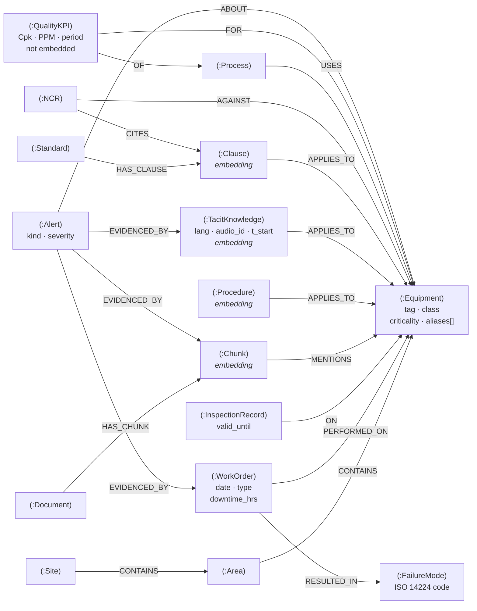
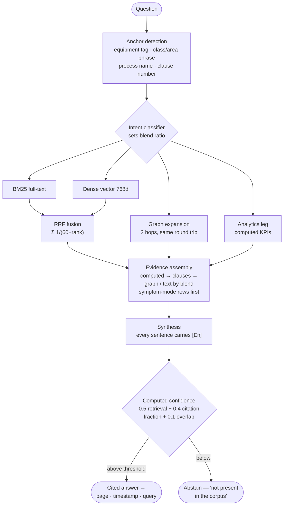
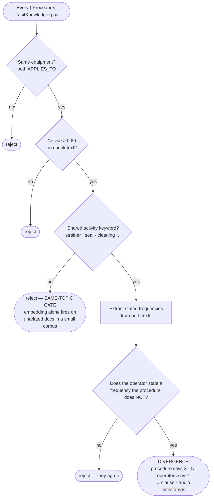

# Plant Brain — Project Context Document

> Complete build record for the ET AI Hackathon 2026, Problem Statement 8 entry.
> This file is the single source of context: the problem, every method and design
> decision in use, the full record of what was built, the measurements that verify
> it, and what remains. Written to be readable by both people and language models.

| | |
|---|---|
| **Status** | Operational · voice recordings pending |
| **Datastore** | Neo4j 5.26 (single store: vector + full-text + structured) |
| **Reasoning model** | qwen2.5:7b-instruct via Ollama |
| **Embeddings** | nomic-embed-text, 768 dimensions (locked) |
| **Speech** | faster-whisper large-v3, CPU int8 |
| **GPU footprint** | 6 GB |
| **Codebase** | ~4,200 lines, 13 commits |
| **Graph** | 15 node labels, 16 relationship types, 279 nodes |
| **Evaluation** | 21/21 passing, 12.0 s mean latency |
| **Deployment** | Fully local — no cloud API at any point |

---

## Table of contents

1. [The problem](#01--the-problem)
2. [What we built](#02--what-we-built)
3. [Scope decisions](#03--scope-decisions)
4. [Platform and models](#04--platform-and-models)
5. [The corpus](#05--the-corpus)
6. [System architecture](#06--system-architecture)
7. [Ingestion pipeline](#07--ingestion-pipeline)
8. [Graph schema](#08--graph-schema)
9. [Retrieval design](#09--retrieval-design)
10. [Divergence detection](#10--divergence-detection)
11. [QMS integration](#11--qms-integration)
12. [Feature inventory](#12--feature-inventory)
13. [Build record](#13--build-record)
14. [Engineering log](#14--engineering-log)
15. [Measured results](#15--measured-results)
16. [Running the system](#16--running-the-system)
17. [Demo script](#17--demo-script)
18. [Status and scale](#18--status-and-scale)

---

## 01 — The problem

A large industrial plant runs seven to twelve disconnected document systems.
Engineering drawings in one, maintenance work orders in another, operating procedures
in a third, inspection records in a fourth, regulatory paperwork buried in email.
Staff spend roughly **35% of their working hours searching for information that
already exists** somewhere in the organisation.

That fragmentation contributes to **18–22% of unplanned downtime**, because
maintenance decisions get made without complete equipment history. An engineer
deciding whether a pump can wait until the next outage often cannot see that its
three sister units failed the same way last year.

Separately and more permanently: around **25% of India's experienced industrial
engineers and operators retire within the next decade**, taking undocumented
operational knowledge with them. The knowledge that never made it into a procedure —
which machine runs hot in summer, which interval the manual gets wrong — leaves with
them.

### What Problem Statement 8 asks for

An AI platform that ingests heterogeneous industrial documents, extracts entities
(equipment tags, process parameters, regulatory references, personnel, dates), builds
a unified knowledge graph, and makes the collective intelligence *queryable and
actionable at the point of need*.

| Judging criterion | Weight | How this build addresses it |
|---|---|---|
| Innovation | 25% | Multilingual voice capture of retiring operators; procedure-vs-practice divergence detection |
| Business impact | 25% | Every alert states avoidable downtime in hours, computed from that failure mode's own history |
| Technical excellence | 20% | Hybrid retrieval with graph expansion; computed confidence; measured ablation study |
| Scalability | 15% | Blackboard architecture — the eight deferred agents require zero changes to existing ones |
| User experience | 15% | Streaming answers, clickable citations to page and audio timestamp, live graph explorer |

---

## 02 — What we built

A system that ingests factory documents into a Neo4j knowledge graph, answers
questions with citations that resolve to a specific page or audio second, watches
equipment history for failure patterns without being asked, captures retiring
operators' spoken knowledge in any language, and maps quality findings back to the
standard clause that governs them. Everything runs locally — **no cloud API at any
point**.

### The two differentiators

Most of the system is substrate. Two capabilities make it distinct, and every scope
decision protected them:

1. **Voice capture** — multilingual audio from retiring staff, translated to English
   and structured into typed knowledge claims, with the original audio playable at the
   exact second the claim was spoken.
2. **Procedure-vs-practice divergence** — detecting where the written procedure and
   what operators actually do have drifted apart. No document system surfaces this,
   because it requires holding unverified spoken practice and approved policy as
   separate things and then deliberately comparing them.

> **The insight that ties them together.** The retiring-workforce problem and the
> fragmented-documents problem are usually treated separately. They are the same
> problem: knowledge that exists but is not reachable at the moment of decision.
> Divergence detection is what happens when you make both reachable in one graph —
> the procedure says monthly, three operators independently say fortnightly during
> monsoon, and the system can now notice.

---

## 03 — Scope decisions

What was deliberately *not* built matters as much as what was. Each cut below was a
full day of work carrying real risk, and none adds a capability the platform does not
already demonstrate through another door.

| Not built | Reason |
|---|---|
| P&ID / drawing parsing (computer vision) | A full day of work, high risk, and every competing team will demo it |
| OCR / scanned documents | Adds a failure mode; the corpus is generated, so we control formats |
| Email ingestion | Another door into the same pipeline, no new capability |
| Text-to-Cypher / counting questions | Not in the demo script |
| Alert subgraph image rendering | The evidence chain shows as a structured list instead |
| Mobile app / on-device inference | Server-hosted responsive web only |
| Any additional AI model | Headroom exists — it was spent on stability instead |

Both computer vision and OCR appear in the problem statement's suggested technologies.
They were cut consciously, not overlooked — see [section 18](#18--status-and-scale)
for how they fit the production design.

---

## 04 — Platform and models

Hard constraint: a single laptop with a **6 GB GPU**. The original plan assumed 8 GB,
so allocation was re-benchmarked rather than assumed — a decision that changed which
model runs in production.

| Model | Placement | Size | Role |
|---|---|---|---|
| `qwen2.5:7b-instruct` | 82% GPU / 18% CPU | 4.7 GB | Relation binding, transcript structuring, answer synthesis, alert narratives |
| `nomic-embed-text` | GPU | 275 MB | All embeddings, 768 dimensions — locked on hour one |
| `faster-whisper large-v3` | CPU, int8 | 1.5 GB | Speech to English in one pass |

### Decisions worth defending

**The 7B stayed despite not fitting in VRAM.** Benchmarking showed it splits 82/18
GPU/CPU and sustains a stable 22–28 tokens/sec. A 4B alternative fit entirely in VRAM
but showed severe variance — 71 tok/s on one call, then 4.9 on the next. Stable and
slower beats fast and unpredictable when there is one take on stage. The 4B remains as
emergency fallback.

**Whisper is on CPU deliberately.** On GPU it would contend with the 7B for VRAM. At
int8 on CPU it runs several times faster than realtime, and transcription happens once,
offline, before the demo. Downsizing to a smaller Whisper was rejected outright —
Indian-language accuracy degrades sharply.

**Embedding dimension is irreversible.** 768 was fixed in the first thirty minutes and
never revisited. Changing the embedding model later invalidates every vector index and
forces a complete re-ingest.

### Stack

- **Neo4j 5.26** — single datastore. Native vector index plus Lucene full-text means no
  separate vector database to keep in sync.
- **Ollama** — all inference, fully local.
- **FastAPI** — backend, with server-sent events for streaming.
- **Plain responsive HTML/JS** — no framework, no build tooling.
- **faster-whisper** — speech recognition. **APScheduler** — the Watch agent's timer.

---

## 05 — The corpus

Every document is produced by a **seeded, deterministic generator** — nothing is
hand-authored. When the schema changes you regenerate rather than rewrite. Critically,
the generators **assert their own output**: every planted pattern is verified on every
run, and the script exits non-zero if any is broken.

| Artefact | Count | Detail |
|---|---|---|
| Equipment register | 12 | 6 pumps sharing one class (needed for fleet analysis), 3 exchangers, 3 control valves |
| Work orders | 119 | 61 preventive · 40 corrective · 18 inspection, spanning three years |
| Inspection records | 6 | 2 deliberately expired |
| Procedures (SOP PDFs) | 8 | 826–910 words each |
| Quality standard | 1 | QS-001, 9 clauses, 835 words, original text |
| Quality KPIs | 72 | 3 processes × 2 metrics × 12 months |
| Non-conformance records | 6 | each linked to equipment and a clause |
| Voice clips | 3 | Tamil, Hindi, one more — **to be recorded** |

> **Why procedures are 800+ words.** Short documents produce a single chunk each, which
> makes the retrieval demo look trivial — there is nothing to retrieve *from*. The
> generator enforces the word count as a verified assertion.

### The six planted patterns

These are not decoration. Every demo moment depends on one of them existing, so each is
asserted by the generator.

| # | Pattern | Construction | What it demonstrates |
|---|---|---|---|
| **P1** | Overdue | P-101A, four seal failures at 88/84/86-day intervals, last one 80 days before demo | MTBF ≈ 86 d, risk ratio ≈ 0.93 — clears the 0.8 alert threshold |
| **P2** | Sibling exposure | Plugged-strainer failures on P-101A/B/C only; P-102A, P-102B, P-103A share the class but have no such history | One failure identifies five sister pumps — two with confirmed history, three needing preventive checks |
| **P3** | Chronic | P-102A, four vibration failures inside twelve months | Same fault repeatedly — nobody fixed the root cause |
| **P4** | **Divergence** | SOP-114 states monthly strainer cleaning; three voice transcripts independently say fortnightly during monsoon | **The winning finding.** Written policy vs. actual practice |
| **Q1** | Capability drift | PRC-301 process capability falling 1.41 → 1.34 → 1.21 | Breaches the 1.33 minimum; ties to CV-301A's expired calibration record |
| **Q2** | Defect trend | PRC-101 defect rate rising 165 → 240 → 310 → 420 through monsoon months | Three consecutive rises; ties to the strainer story and clause 8.5.1 |

### Injected messiness

Deliberate, and demonstrable — this is what proves entity resolution actually works.
The same pump is written four different ways across the corpus:

| Spelling | Appears in |
|---|---|
| `P-101A` | work orders |
| `Pump 101A` | procedures |
| `P101-A` | one inspection record |
| `p-101a` | one voice transcript |

Date formats vary between files (`DD/MM/YYYY` vs `YYYY-MM-DD`), and one failure code
carries a deliberate typo (`LKE` for `LEK`) that the pipeline must repair.

---

## 06 — System architecture

Four agents operate on a **blackboard**: no agent ever calls another. They read and
write shared graph state, which is why the eight deferred agents can be added without
modifying a single existing one.



*Rendered image: `docs/img/fig1_architecture.png`*

---

## 07 — Ingestion pipeline

The most consequential structural decision in the build: **clean data never touches the
language model**. Spreadsheets are already typed; running them through an extraction
model only introduces hallucination into the most reliable source available.

The payoff is large. Structured-first means the 7B processes roughly 40 narrative chunks
instead of ~500 — extraction drops from about 50 minutes to under 5, and the model's
weaker relation-binding stops being a risk to the whole graph.



*Rendered image: `docs/img/fig2_ingestion.png`*

> **Entity resolution is the single point of failure.** Three nodes for one pump means
> every multi-hop query silently returns nothing — not an error, just emptiness. It is
> verified by hand before anything downstream is trusted, and the interface exposes it
> as a panel so the merge is visible rather than assumed.

---

## 08 — Graph schema

One database, two deliberately different storage modes. Document content carries 768-d
embeddings for semantic retrieval. Facts and measurements are typed nodes queried by
Cypher and computed over — **never embedded**, because a vector search cannot do
arithmetic.



*Rendered images: `docs/img/fig3a_schema_core.png` (maintenance) and
`docs/img/fig3b_schema_qms.png` (quality extension)*

### Node labels

| Label | Embedded? | Key properties |
|---|---|---|
| `:Site` | no | name |
| `:Area` | no | name |
| `:Equipment` | no | tag, iso14224_class, criticality, aliases[] |
| `:FailureMode` | no | code (ISO 14224), description |
| `:WorkOrder` | no | wo_id, date, type, downtime_hrs, description, technician |
| `:InspectionRecord` | no | record_id, date, result, valid_until |
| `:Document` | no | doc_id, path, doc_type, ingested_at |
| `:Chunk` | **yes** | chunk_id, text, embedding, page, doc_id |
| `:Procedure` | **yes** | sop_id, title, embedding |
| `:TacitKnowledge` | **yes** | claim_id, text, lang, speaker_role, audio_id, t_start, t_end, embedding |
| `:Standard` | no | std_id, title, overlay |
| `:Clause` | **yes** | clause_id, title, text, page, embedding |
| `:NCR` | no | ncr_id, date, description, status |
| `:Process` | no | process_id, description |
| `:QualityKPI` | **no — deliberately** | process_id, metric, period, value |
| `:Alert` | no | alert_id, kind, severity, status, created_at, detail, narrative, avoidable_hrs |

### Relationship types

`CONTAINS`, `PERFORMED_ON`, `RESULTED_IN`, `ON`, `HAS_CHUNK`, `MENTIONS`, `APPLIES_TO`,
`ABOUT`, `EVIDENCED_BY`, `DESCRIBES`, `HAS_CLAUSE`, `CITES`, `AGAINST`, `USES`, `OF`,
`FOR`

### The one schema rule that cannot be broken

`:TacitKnowledge` and `:Procedure` are **separate labels**. Spoken operator experience
is one person's unverified practice; a procedure is approved policy. Merging them would
be unsafe in a plant context — and keeping them apart is the only reason divergence
detection is possible at all.

### Live inventory

| Node label | Count | Node label | Count |
|---|---:|---|---:|
| WorkOrder | 119 | Clause | 9 |
| QualityKPI | 72 | Document | 8 |
| Chunk | 24 | Procedure | 8 |
| Equipment | 12 | FailureMode | 7 |
| Alert | 7 | NCR | 6 |
| InspectionRecord | 6 | Process | 3 |
| Area | 2 | Site / Standard | 1 / 1 |
| TacitKnowledge | 0 | *(awaiting voice recordings)* | |

Constraints exist on every identifier; vector indexes on all four embedded labels; a
full-text index on chunk text. **Neo4j fails quietly** on missing indexes and dimension
mismatches — it returns nothing rather than raising — so the schema script prints what
actually exists after applying.

---

## 09 — Retrieval design

Both retrieval types are required because they fail on opposite question shapes.
Keyword search catches exact tags and standard codes that embeddings miss. Dense
retrieval catches paraphrase — *"won't build pressure"* matching *"insufficient
discharge head"*. Neither reaches a question whose answer shares no vocabulary with it:
a report on P-101C's failure never contains the string "P-101A". Only walking
**equipment → same class → other equipment** does.



*Rendered image: `docs/img/fig4_retrieval.png`*

### Anchor forms

A question can anchor on any of these; if none match, retrieval falls back to text only:

- an explicit equipment tag (`P-101A`, and any of its four spellings)
- a class or area phrase — *"the control valves in the process area"*
- a process name — *"the feed flow control process"* → PRC-301
- a clause number — *"clause 8.5.1"*

### Blend, never branch

The intent classifier adjusts **how much** text versus graph evidence is assembled; it
never switches one off. Misclassifying an exclusive branch returns nothing. A wrong
blend still returns something useful.

### Evidence ordering

1. Computed analytics (KPI series + threshold verdict) — leads for numeric questions
2. Clauses — the most precise evidence when a compliance question is in play
3. Graph facts, then text — order flips based on the intent blend
4. Within equipment history, rows matching the question's **symptom mode** sort first

### Confidence is computed, never self-reported

```
confidence = 0.5 × normalised top retrieval score
           + 0.4 × fraction of answer sentences carrying a citation
           + 0.1 × overlap between BM25 and dense top-k
```

Below threshold the system abstains. In a safety context, **"not present in the corpus"
is the correct answer**, and a confident wrong answer about plant equipment is worse
than no answer at all.

---

## 10 — Divergence detection

The differentiating finding, and the hardest logic in the build. Naive approaches fail
in two specific ways, both of which had to be designed around.



*Rendered image: `docs/img/fig5_divergence.png`*

### Failure mode 1 — embedding similarity alone

On a small corpus, semantic similarity fires constantly on unrelated documents. Two
texts about plant maintenance look similar to a vector regardless of whether they
concern the same task. The fix is a **same-topic gate**: the procedure and the claim
must apply to the same equipment *and* share an explicit maintenance-activity keyword
before their frequencies are compared at all.

### Failure mode 2 — the intersection trap

Operators almost always *cite the official interval while rejecting it*: *"the book says
monthly, but we do it fortnightly."* A naive set intersection sees "monthly" in both
texts and concludes the two agree — silently missing the exact finding it was built to
catch. The detector instead isolates the frequency the operator states that the
procedure does **not**, which is the actual deviating practice.

A third refinement: findings collapse to **one alert per procedure** rather than one per
matched keyword, which otherwise produced three near-duplicate alerts for the same
underlying divergence.

---

## 11 — QMS integration

Quality management is a **specialization of the same architecture**, not a second
system — same graph, same agents, same retrieval logic. Only the ingested standards pack
and the KPI definitions differ.

### Clause-aware chunking

The standard splits on **clause numbers, not fixed token windows**. A clause is the
natural retrieval unit in compliance; splitting one mid-sentence produces answers that
cite half a requirement, which is worse than useless in an audit.

### Numbers are never embedded

This is where pure-RAG architectures typically fail. Capability and defect rates load
into typed `:QualityKPI` rows an agent queries and computes over. Embedding
*"Cpk = 1.21"* as a sentence and hoping a vector search retrieves it correctly cannot
support arithmetic, threshold tests, or trend detection. Thresholds come from
configuration, so every computed figure is reproducible and carries the exact query that
produced it.

### Compliance mapping

Non-conformance records link equipment to the clause they breach. That is what lets
*"why is PPM rising on the feed transfer process"* traverse from a number → the process
→ the equipment → the open NCR → governing clause 8.5.1 → and the monsoon strainer
story that explains it. No vector search reconstructs that chain.

### Industry-agnostic by configuration

The pipeline is fixed; the standards pack swaps. Configuration (`STANDARDS_PACK` in
`pipeline/config.py`) defines which base standard applies, its clause taxonomy, and the
industry's KPI definitions — defect rate for automotive, batch yield for pharma, lot
traceability for food. Graph schema and agent logic stay identical. That is what makes
this **one architecture rather than one build per industry**.

### The quality standard (QS-001)

Nine clauses, original text, automotive customer overlay:

| Clause | Title |
|---|---|
| 4.1 | Context of the plant quality system |
| 7.1.5 | Measurement traceability and calibration |
| 7.2 | Competence and knowledge retention |
| 8.1 | Operational planning and control |
| 8.5.1 | Control of production equipment condition |
| 8.7 | Control of nonconforming output |
| 9.1 | Process performance monitoring |
| 9.2 | Internal audit |
| 10.2 | Nonconformity and corrective action |

---

## 12 — Feature inventory

Twenty-six implemented capabilities. The **Why** under each states the reason it exists —
in most cases the design was forced by a specific failure it prevents.

### Knowledge construction

**A1 · Deterministic, self-verifying corpus generator**
Every document is produced by a seeded script that asserts its own output; planted
patterns are verified on every run.
*Why: regenerate rather than rewrite when the schema changes, and a corpus that verifies
itself cannot silently lose the patterns the demo depends on.*

**A2 · Entity resolution across four spellings**
The same pump appears four ways across the corpus; all canonicalise to one node with an
alias list.
*Why: the single point of failure. Three nodes for one pump means every multi-hop query
silently returns nothing.*

**A3 · Structured-first ingestion**
Spreadsheet data becomes typed nodes with no LLM in the path.
*Why: running typed data through an extraction model introduces hallucination into the
cleanest source available — and it cuts model workload by over 90%.*

**A4 · Regex-before-LLM relation binding**
Regex finds entities first; the LLM only binds relations between entities already found,
against a closed vocabulary.
*Why: a 7B model is weak at open-ended extraction but adequate at choosing among known
candidates. This plays to that boundary rather than across it.*

**A5 · Failure-code repair**
A mistyped ISO 14224 code is mapped back to the closed vocabulary on load, raw value
preserved.
*Why: real maintenance records contain typos, and a closed vocabulary is what makes the
analytics work at all.*

**A6 · Clause-aware chunking**
The standard splits on clause boundaries rather than token counts.
*Why: a compliance answer citing half a requirement is worse than no answer.*

**A7 · Structured quality store — numbers never embedded**
Capability and defect values are typed rows computed over, not text in a vector index.
*Why: embeddings cannot do arithmetic or trend detection. This is the specific thing
pure-RAG quality systems get wrong.*

### Answering

**B1 · Hybrid retrieval with RRF fusion**
Keyword and dense retrieval run in parallel on every question and fuse by reciprocal
rank.
*Why: they fail on opposite question shapes. Running only one guarantees a class of
question returns nothing.*

**B2 · Graph expansion in a single round trip**
Two hops — equipment → work orders → failure modes → siblings → operator knowledge —
inside the same Cypher statement.
*Why: it answers questions whose answer shares no vocabulary with the question, and one
statement keeps latency flat.*

**B3 · Multi-form anchoring**
Anchors on an explicit tag, a class or area phrase, a process name, or a clause number.
*Why: people rarely quote asset tags. Without phrase anchoring, questions naming a class
wrongly abstained — found in testing, fixed.*

**B4 · Blend ratio, never an exclusive branch**
Intent adjusts the evidence mix; it never switches a retrieval leg off.
*Why: misclassifying an exclusive branch returns nothing; a wrong blend still returns
something useful.*

**B5 · Symptom-aware evidence ordering**
Question wording maps to ISO failure modes; matching history rows sort to the top.
*Why: a real failure — the relevant vibration record sat seventh of seven, the model
overlooked it, and the system abstained on a question it could answer.*

**B6 · Analytics leg for numeric questions**
Capability and trend questions attach computed KPI evidence — series, threshold test,
explicit verdict — ahead of document text.
*Why: two further real failures. Buried mid-prompt the model hedged around its own
computed answer; and when the block said only "PRC-301" it could not bind that to a
question naming "the feed flow control process".*

**B7 · Computed confidence with abstention**
Arithmetic over retrieval strength, citation density and result-set agreement; below
threshold, declines to answer.
*Why: self-reported confidence is ungrounded, and in a plant context a confident wrong
answer is more dangerous than none.*

**B8 · Resolvable citations**
Markers resolve to a document page, an audio second, or the exact query run against the
structured store — and open on click.
*Why: an uncited reference is worse than no answer in compliance, and a citation you
cannot open is just a claim.*

**B9 · Streaming responses with model pre-warm**
Answers stream token by token; models load at startup.
*Why: first tokens appear in about two seconds instead of a blank 10–20 second wait, and
pre-warming removes the cold-start stall entirely.*

**B10 · Show-the-query toggle**
The Cypher behind any answer is inspectable from the answer itself.
*Why: makes the system auditable rather than magic — the difference between a demo and a
tool an engineer would trust.*

### Proactive intelligence

**C1 · Reliability detection — overdue, chronic, sibling exposure**
MTBF and risk ratio from failure intervals; repeat-mode counting; same-class propagation
on failure.
*Why: all three are arithmetic, so a finding can be defended line by line. Sibling
exposure turns one pump's failure into fleet-wide preventive action.*

**C2 · Procedure-vs-practice divergence** *(needs recordings)*
Detects drift between written SOP and actual practice, gated on shared equipment and
shared activity before any comparison.
*Why: the finding no document system surfaces. Proven against synthetic claims; awaiting
real recordings.*

**C3 · Quality detection — capability and defect trend**
Capability below the configured minimum; defect rate rising three consecutive months.
*Why: computed from the structured store rather than retrieved, so the verdict is a
calculation, not a paraphrase.*

**C4 · Business impact in hours**
Each alert states avoidable downtime derived from that failure mode's history on that
equipment class.
*Why: turns a technical finding into a number a plant manager acts on. Narratives are
constrained to facts in the data after the model invented a cost figure during testing.*

**C5 · Evidence chains on every alert**
Alerts link back to the specific work orders, chunks and claims that produced them.
*Why: a finding you cannot trace is a finding nobody will act on.*

**C6 · Compliance mapping**
Findings map to the governing clause through the non-conformance register.
*Why: an auditor's first question is which requirement was breached — and that traversal
is graph-shaped.*

### Interface and evidence of correctness

**D1 · Knowledge graph explorer**
Interactive force-directed view, architecture overview plus per-equipment focus. No
external library.
*Why: a CDN-hosted graph library fails on an air-gapped demo laptop. The focus view
doubles as visual proof that entity resolution worked.*

**D2 · Entity resolution panel**
Shows every merged spelling and what it resolved to.
*Why: makes the least visible and most important part of the pipeline demonstrable at a
glance.*

**D3 · Stopwatch and detected-language badge**
Live timing on every question; source language shown on spoken claims.
*Why: both are explicit judging criteria, and both expose something already computed
rather than adding a failure mode.*

**D4 · Evaluation harness with retrieval ablation**
Twenty-one questions scored across four retrieval configurations, producing a chart.
*Why: converts "our retrieval design is good" into a measurement, and isolates exactly
what the graph contributes.*

**D5 · Configurable standards pack**
Standard identity, clause taxonomy and KPI thresholds live in configuration.
*Why: the difference between one architecture and one build per industry.*

---

## 13 — Build record

Thirteen commits across two working days. The rollback point `v0.1-day2-stable` is
tagged, and a database snapshot exists at `backups/neo4j.dump`.

| Commit | Date | What landed |
|---|---|---|
| `e3dcd12` | 20 Jul | **Tagged stable.** Corpus generator, graph pipeline, Ask + Watch agents, web UI |
| `78b0df8` | 20 Jul | Streaming answers, evidence-quality fixes, eval harness |
| `babbec3` | 20 Jul | Symptom-mode row ordering, graph-first evidence |
| `df4e56b` | 20 Jul | Class/area anchors, inspection evidence, confidence-gate fix |
| `3fbe705` | 20 Jul | Baseline eval and ablation results |
| `a2f3522` | 20 Jul | Post-fix eval, regression-guard questions |
| `af54ced` | 20 Jul | **QMS integration** — clause-aware standard, structured KPIs, retrieval router |
| `5da0721` | 20 Jul | Analytics binding — process names in KPI evidence, computed-first order |
| `94540fb` | 20 Jul | QMS alert cards, README architecture note, QMS eval questions |
| `c1e3cf4` | 21 Jul | **Knowledge graph visualization** |
| `5b7dcfd` | 21 Jul | VSCode launch config |
| `6e692e4` | 21 Jul | Abstain-detection fix — eval reaches 21/21 |
| `77e190c` | 21 Jul | Architecture document |

### File map

```
datagen/
  generate_corpus.py     maintenance corpus + 4 planted patterns, self-verifying
  sop_content.py         source text of the 8 SOPs
  generate_qms.py        QMS corpus + 2 quality patterns, self-verifying
pipeline/
  config.py              all locked decisions + STANDARDS_PACK (industry swap point)
  resolve.py             entity resolution, with inline self-tests
  schema.py              constraints + vector/full-text indexes
  load_structured.py     xlsx → typed nodes (no LLM)
  ingest_narrative.py    SOP PDFs → chunks + embeddings + relation binding
  load_qms.py            clause-aware standard + KPIs + NCRs
  voice_capture.py       P2 — audio → :TacitKnowledge
  ask.py                 P3 — retrieval router, synthesis, confidence
  watch.py               P4 — six detectors + narrative
app.py                   FastAPI backend, all endpoints, APScheduler timer
static/
  index.html             chat UI, alert panel, entity resolution panel
  graph.html             force-directed knowledge graph explorer
  eval.html              ablation chart
scripts/eval.py          21-question harness, 4-way ablation
docs/                    architecture.html, context.html, CONTEXT.md, diagrams
corpus/                  generated dataset (never hand-edit)
```

### API endpoints

| Method | Path | Purpose |
|---|---|---|
| POST | `/api/ask` | Question → cited answer, confidence, citations, timing |
| POST | `/api/ask/stream` | Same, streamed token by token (SSE) |
| GET | `/api/alerts` | Open alerts with evidence chains |
| POST | `/api/watch/run` | Trigger a Watch sweep now |
| GET | `/api/stats` | Graph counts + entity-resolution panel data |
| GET | `/api/graph` | Graph visualization data (`?focus=TAG` for ego network) |
| GET | `/api/doc/{doc_id}` | Procedure or standard PDF (citation click-through) |
| GET | `/api/audio/{name}` | Voice clip (seek-to-timestamp playback) |

---

## 14 — Engineering log

Every defect below was found by **running** the system rather than reading it, and each
drove a design change that survives in the code. They are recorded because *how* a
system was debugged is stronger evidence of its soundness than a claim that it works.

1. **Truncated evidence cut the answer out of the evidence.** Chunk evidence was capped
   at 1,200 characters — which sliced off SOP-114's monthly-interval sentence, the exact
   text the flagship strainer question needed. The system abstained on a question it had
   the answer to. Fixed by passing full chunks and raising the model's context window.

2. **Citation markers collided with the documents' own numbering.** Answers cited `[1]`,
   but the SOPs contain numbered sections, so the model began citing section numbers as
   if they were evidence. Switched to unambiguous `[E1]` markers.

3. **A relevant record at the bottom of a table was invisible.** The flagship vibration
   question failed because the one matching record sat seventh of seven rows. The model
   summarised the visible rows and concluded no such history existed. Question wording
   now maps to failure modes and matching rows sort to the top.

4. **Questions naming a class instead of a tag anchored nothing.** *"The control valves
   in the process area"* retrieved procedure text only and wrongly abstained. Class and
   area phrases now resolve to equipment sets — and correctly exclude valves in other
   areas.

5. **The confidence gate was overwriting correct answers.** A substantive, correctly
   cited answer could be replaced wholesale with "not present in the corpus" because a
   structurally noisy overlap term dragged the score down. Weights recalibrated toward
   retrieval strength and citation density; cited answers now only abstain when
   confidence collapses entirely.

6. **The model invented a cost figure.** An alert narrative asserted "$10,000 per hour of
   lost production" — a number that appears nowhere in the data. Narrative generation is
   now explicitly constrained to facts present in the alert, with avoidable downtime as
   the only business figure.

7. **Divergence detection concluded agreement on the divergence.** Operators say *"the
   book says monthly, we do fortnightly"* — so "monthly" appears in both texts and set
   intersection declared them in agreement, silently missing the finding. Now isolates
   the frequency the operator states that the procedure does not.

8. **Computed answers hedged when buried mid-prompt.** The capability question kept
   refusing despite a clear NOT CAPABLE flag in evidence. Two causes: computed blocks sat
   below document text, and the block named only "PRC-301" while the question said "the
   feed flow control process" — so the model could not bind them and correctly declined.
   Computed evidence now leads, and carries the process name.

9. **The system did not recognise its own refusal.** The model writes *"Not present in
   the corpus [E1][E2]."* — citation markers land before the period, so a
   period-inclusive string match failed. The refusal was correct; the detection of it was
   not. Eval scored it a failure and the interface would not have flagged it. Matching
   now ignores trailing punctuation.

10. **A planted pattern was contaminated by random data.** Randomly generated corrective
    work orders happened to give P-102A a plugged-strainer failure, which broke the
    sibling-exposure pattern's clean split. Protected combinations are now excluded from
    random generation, and the generator asserts the pattern.

### Environment findings

- The GPU is **6 GB, not the 8 GB assumed** — model allocation was re-benchmarked rather
  than inherited.
- **Neo4j runs as a foreground console process**, so it stops when its terminal closes.
  Installing it as a Windows service is recommended before demo day.
- **Machine sleep evicts Ollama models mid-inference**, surfacing as an HTTP 500; the
  next call reloads them.
- Python must be invoked as **`py`** — plain `python` hits the Windows Store stub.
- Starting a second Neo4j instance fails on `store_lock`. That error means it is
  **already running**, not that it is broken.

---

## 15 — Measured results

A question passes only if the abstain decision is correct **and**, for answerable
questions, an expected source appears in the citations the answer actually used. Citing
the right document by luck while answering from elsewhere does not pass.

| Suite | Passed | Mean latency | Composition |
|---|---:|---:|---|
| Full pipeline | **21 / 21** | 12.0 s | 12 equipment/procedure · 3 QMS router paths · 3 abstain traps · 3 regression guards |

### Retrieval ablation

Measured on the 15-question maintenance suite, disabling one retrieval leg at a time:

| Configuration | Passed | Failure character |
|---|---:|---|
| Full — hybrid + graph | 15 / 15 | — |
| Dense only (no keyword) | 14 / 15 | an exact-threshold lookup |
| Keyword only (no dense) | 14 / 15 | same |
| **No graph expansion** | **11 / 15** | **every failure is an equipment-history question** |

The ablation makes the architectural argument precisely: removing graph traversal fails
*exactly* the questions whose answers share no vocabulary with the question. That is the
class of question a vector database alone cannot serve, and it is the reason this is a
knowledge graph rather than a document index.

> **Honest reading of the single-leg rows.** Dense-only and keyword-only score higher
> than they would in a pure-RAG system, because graph anchoring still carries them — the
> text legs are crippled but equipment traversal is not. The clean, defensible finding is
> the no-graph row. **Lead with that one.**

---

## 16 — Running the system

Two background services must be up before the application starts; the graph itself
persists on disk, so the ingestion pipeline is a **one-time operation**, not part of
routine startup.

### Routine startup

1. **Neo4j** — not a Windows service, so it must be started manually and left running:
   ```powershell
   $env:JAVA_HOME="C:\Users\krith\tools\jdk-21.0.11+10"
   & "C:\Users\krith\tools\neo4j-community-5.26.0\bin\neo4j.bat" console
   ```
   Check first — if this returns `True`, it is already running and a second instance will
   fail on the database lock:
   ```powershell
   Test-NetConnection localhost -Port 7687 -InformationLevel Quiet
   ```
2. **Ollama** — usually already running as a tray app; otherwise `ollama serve`.
3. **Application** — `py app.py` (or F5 in VSCode). Serves on http://localhost:8000.

### Full rebuild from scratch

Only needed after regenerating the corpus or wiping the database:

```bash
py datagen/generate_corpus.py
py datagen/generate_qms.py
py pipeline/schema.py            # constraints + indexes, BEFORE any ingestion
py pipeline/load_structured.py
py pipeline/ingest_narrative.py
py pipeline/load_qms.py
py pipeline/voice_capture.py     # once audio clips are in corpus/audio/
```

### Verification

```bash
py scripts/eval.py           # 21 questions × 4 ablations (~25 min)
py scripts/eval.py --quick   # 21 questions, full pipeline only (~5 min)
py pipeline/resolve.py       # entity-resolution self-tests
py pipeline/watch.py --dry --no-narrative   # detection without writing
```

### Key paths

| What | Where |
|---|---|
| Neo4j data | `C:\Users\krith\tools\neo4j-community-5.26.0\data\databases\neo4j\` |
| Neo4j config | `C:\Users\krith\tools\neo4j-community-5.26.0\conf\neo4j.conf` |
| Database backup | `backups/neo4j.dump` |
| Neo4j credentials | user `neo4j`, password `plantbrain` |
| Neo4j Browser | http://localhost:7474 |

---

## 17 — Demo script

Three minutes. **Steps 4 and 6 are what win** — rehearse those hardest.

1. **Run the ingest** — the graph counter ticks up live.
2. **Entity resolution panel** — four spellings visibly merged to one asset.
3. **Ask the vibration question** — *"P-101A keeps tripping on high vibration, has this
   happened before?"* Cited answer, stopwatch showing seconds, click a citation to land
   on the exact page.
4. **Click a different citation** — Tamil audio plays, with the English claim beside it.
5. **Alert panel** — five sister pumps identified, evidence chain shown,
   downtime-avoided figure stated.
6. **Divergence panel** — *"SOP-114 says monthly. Three operators say fortnightly during
   monsoon."*
7. **Ask something outside the corpus** — the system abstains.

> **Record the video before polishing.** Single laptop, live system, 6 GB GPU — thirty
> minutes of recording is complete insurance against anything failing on stage.

### Verified demo questions

These are tested and passing:

- "P-101A keeps tripping on high vibration - has this happened before?"
- "How often should the suction strainers on the P-101 pumps be cleaned?"
- "Which pumps share the same class as P-101A and what failures have they had?"
- "How much downtime have seal failures caused on P-101A?"
- "Has HX-202A had fouling or overheating problems?"
- "What is the failure history of the control valves in the process area?"
- "Have any control valve inspections expired?"
- "What does clause 8.5.1 require?"
- "Is the feed flow control process still capable?"
- "Why is PPM rising on the feed transfer process?"
- Abstain traps: "What is the boiler feedwater treatment procedure?" · "What is the
  turbine lube oil specification?" · "Who is the plant manager of Plant Site A?"

---

## 18 — Status and scale

| Component | Status |
|---|---|
| Corpus generation, graph build, entity resolution | Operational |
| Ask agent — retrieval, synthesis, citations, abstention | Operational |
| Watch agent — 5 of 6 detectors firing | Operational |
| QMS — clauses, KPIs, compliance mapping | Operational |
| Web interface, graph explorer, eval harness | Operational |
| Voice capture — code complete, pipeline proven | **Awaiting 3 recordings** |
| Divergence detection — logic proven on synthetic claims | **Unblocks with voice** |
| Telegram delivery — stretch item | Deferred |

### The one open dependency

Three voice recordings of roughly ninety seconds each, in three languages, spoken
naturally rather than read. Each must independently state that P-101 strainers need
fortnightly cleaning during monsoon while the manual says monthly. Everything downstream
— transcription, translation, claim extraction, divergence detection — is built and
proven; it is waiting only on the audio. Recording guide:
`docs/voice_recording_scripts.md`.

### Why four agents, and what the other eight are

The production design is **twelve agents across four tiers** — ingestion, query,
intelligence, delivery. The prototype implements four. The remaining eight are:

1. Email triage
2. Cypher generation (text-to-query)
3. Root cause analysis
4. Compliance auditing
5. Lessons-learned clustering
6. Multi-channel notification
7. Drawing / P&ID parsing
8. OCR / document intelligence

Because the architecture is a **blackboard** — agents read and write shared graph state
and never call each other — **adding the missing eight requires changing zero existing
agents**. A new agent subscribes to the graph, writes its findings back as nodes, and
every existing agent can consume them without knowing it exists.

Knowing precisely what was deferred, and why, is engineering judgment rather than
omission.

---

## Appendix — vocabularies and constants

### ISO 14224 failure modes (closed vocabulary)

| Code | Description |
|---|---|
| SER | Seal leakage |
| VIB | Excessive vibration |
| BRG | Bearing failure |
| PLU | Plugged / choked |
| LEK | External leakage |
| OHE | Overheating |
| ELP | Electrical problem |

A closed vocabulary is what makes the reliability analytics work; the loader repairs
typos against it rather than dropping the record.

### Equipment register

| Tag | Class | Area | Criticality |
|---|---|---|---|
| P-101A | centrifugal_pump | Area-1 | high |
| P-101B | centrifugal_pump | Area-1 | high |
| P-101C | centrifugal_pump | Area-1 | medium |
| P-102A | centrifugal_pump | Area-2 | high |
| P-102B | centrifugal_pump | Area-2 | medium |
| P-103A | centrifugal_pump | Area-2 | low |
| HX-201A | heat_exchanger | Area-1 | high |
| HX-201B | heat_exchanger | Area-1 | medium |
| HX-202A | heat_exchanger | Area-2 | low |
| CV-301A | control_valve | Area-1 | medium |
| CV-302A | control_valve | Area-1 | low |
| CV-303A | control_valve | Area-2 | low |

### Watch agent detectors and thresholds

| Detector | Rule | Currently firing |
|---|---|---|
| `overdue` | days since last ÷ MTBF ≥ 0.8 | P-101A / SER — MTBF 86 d |
| `chronic` | same mode ≥ 3 times in 12 months | P-101A (4× SER), P-102A (4× VIB) |
| `sibling_exposure` | recent failure → same-class equipment | P-101A, P-102A — 5 sisters each |
| `divergence` | same-topic gate → frequency set-difference | blocked on voice clips |
| `capability` | latest Cpk < 1.33 | PRC-301 — Cpk 1.21 |
| `ppm_trend` | rising 3 consecutive months | PRC-101 — 240 → 310 → 420 |

### Configuration constants (`pipeline/config.py`)

```python
EMBED_DIM = 768                  # LOCKED — changing forces full re-ingest
RISK_RATIO_THRESHOLD = 0.8       # overdue alert
CHRONIC_COUNT = 3                # same mode in window
CHRONIC_WINDOW_DAYS = 365
CHUNK_TARGET_TOKENS = 600
CHUNK_OVERLAP = 0.15
STANDARDS_PACK = {               # industry-agnostic swap point
    "std_id": "QS-001",
    "kpi_defs": {
        "CPK": {"min": 1.33},
        "PPM": {"rising_months": 3},
    },
}
```

### Ask agent constants (`pipeline/ask.py`)

```python
TOP_K = 8                        # per retrieval leg
MAX_TEXT_EVIDENCE = 5            # chunk blocks (2 when analytics leads)
MAX_CHUNK_CHARS = 2800           # full chunk — truncation caused a real bug
MAX_ANSWER_TOKENS = 350
LLM_OPTIONS = {"num_ctx": 6144}  # 4096 silently clipped long evidence
CONFIDENCE_THRESHOLD = 0.45      # uncited answers below this abstain
FORCE_ABSTAIN_BELOW = 0.30       # even cited answers abstain under this
DIVERGENCE_COSINE_GATE = 0.60
```
